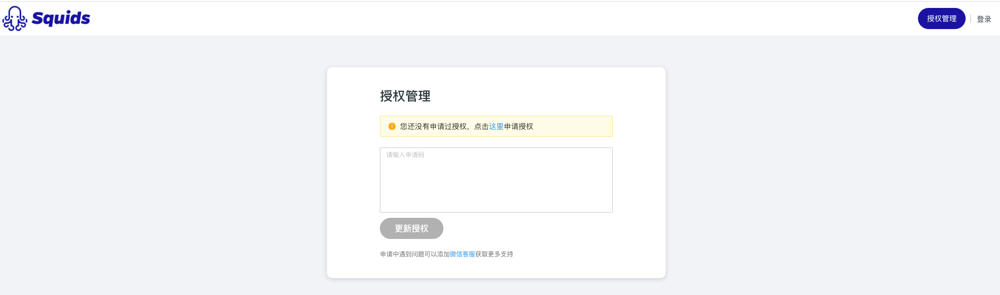
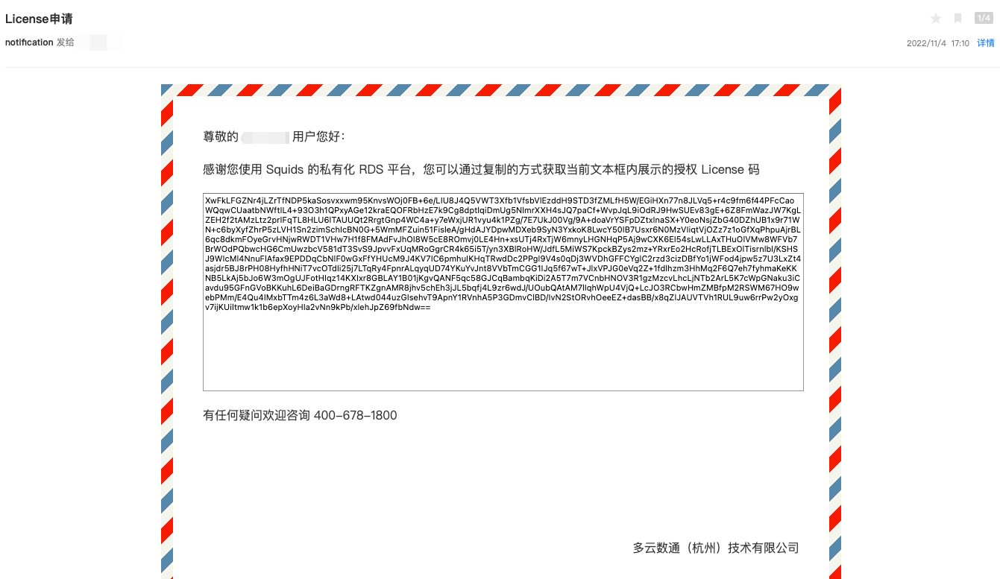

# 申请授权流程

## 登录Squids管理平台

* 直接输入主机ip（单机版）或 Loadbalancer ip即可访问Squids管理平台。

## 申请授权

* 首次访问（或无可用授权时访问），会跳转到授权管理页面，请依据提示申请 24 vCPU 的永久免费授权，以便开始使用平台功能。
  
  &nbsp;
  
  &nbsp;

* 可直接点击进行授权码的申请，授权信息将以邮件的形式发送到您的邮箱当中。 

  授权邮件格式如下：

  &nbsp;
  
  &nbsp;

* 如您发现邮件没有正常收到，可以先自行检查邮件是否被当成垃圾邮件所过滤，若已自查过发现依然没有正常收到，可直接联系 [在线客服]() 进行处理。
* 复制邮件中的授权码，回到授权管理页面点击 **更新授权** 即可完成授权，开始平台的试用了。

### 升级更多授权数量？
* 如果我们提供的 24 vCPU 的免费授权无法满足您的测试需要，可以联系 [在线客服]()