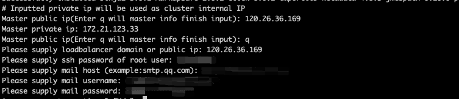
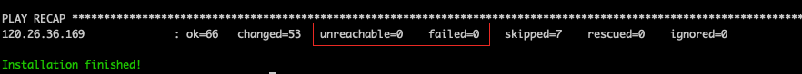
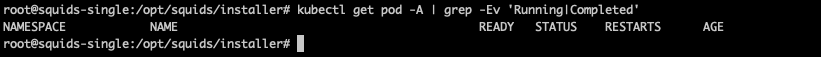

# 公有云平台基于镜像安装

## 镜像安装包使用

### 镜像安装包获取

* 您可以选择在阿里云、华为云或腾讯云平台完成对 Squids RDS 的安装部署，进入 [下载中心](http://squids.cn/download) 下载您所需要的镜像安装包。

### 镜像导入云平台

* 您可以按照不同云平台的官方文档进行 squids-rds 镜像的导入和使用。
    * [阿里云导入自定义镜像](https://help.aliyun.com/document_detail/25464.html)
        * 阿里云导入镜像后的镜像检测可能存在建议优化项，不影响正常使用，阿里云助手等工具可以在启动云主机后进行安装。
    * [华为云导入自定义镜像](https://support.huaweicloud.com/usermanual-ims/zh-cn_topic_0030713191.html)
    * [腾讯云导入自定义镜像](https://cloud.tencent.com/document/product/213/4945)
        * 腾讯云导入方式选择**强制**导入

## 安装部署

### 环境配置要求

* [单Master环境要求](single-master-requirement.md)
* [高可用Master环境要求](highly-available-cluster-requirement.md)

### 创建云主机

* 阿里云：按照云平台提示以及配置要求正常安装即可，建议自定义root密码。
* 腾讯云、华为云：登录方式保留镜像设置，在云主机启动之后通过 `passwd` 命令或云平台管控页面进行密码重置。

### 连接云主机

您可以通过 **远程连接工具** 或 **ssh操作命令** 登陆云主机，OS 镜像内置默认用户名为 `root`，密码为 `SquidsRDS123!`（请及时修改默认密码）

### 执行安装命令

**注意: 无论是单机版本还是高可用版本，仅一台节点执行安装脚本即可**

1. 进入 `/opt/squids/instller` 目录，执行安装脚本 `bash install.sh`。请根据提示，依次输入节点信息以及发件邮箱等必要信息。

   

* 其中单机模式 loadbalancer 提供为当前云主机的公网IP即可。

2. 开始安装之后，请不要关闭当前窗口（可以最小化），整个安装过程大约会花费 20-30 分钟左右。

* 云主机节点的 unreachable 及 failed 结果都是0则安装过程正常。

  

* 如果安装过程中出现报错，首先检查输入 IP 信息是否正确，如不正确可进入 `/opt/squids/instller` 文件夹，修改为正确IP地址后，再次执行安装脚本。 若IP地址经检查正确无误，请联系 [在线客服](#) 进行处理。

### 安装结果检查

1. 执行 `kubectl get pod -A | grep -Ev 'Running|Completed'`查看集群 pod 状态是否就绪，若安装正常，大约5min左右所有 pod 状态即可为 Running 或 Completed 状态。可使用该命令检查是否仍存在异常 pod 状态。

   

   安装成功之后即可正常登陆平台，具体操作可参考 [申请授权](apply-for-authorization.md) 进行功能使用。
2. 如果 10 分钟以上仍有非 Running/非Completed 的状态，请联系 [在线客服](#) 进行处理。
3. 常见异常状态参考：
    * Pending          : 调度失败，资源不足，或者节点存在 Pod 不能容忍的污点
    * Terminating      : 磁盘空间不足，Dockerd 与 containerd状态不同步
    * CrashLoopBackOff : Pod 反复拉起后退出登陆，一般是系统配置问题，比如内存资源不足，系统 OOM，cgroup OOM
    * OOMKilled        : 节点内存不足或启动内存有限制
    * Evicted          : 磁盘空间不足
